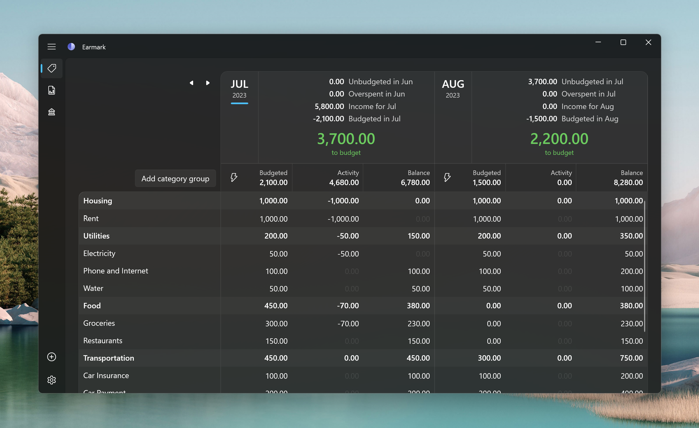

# Earmark

Earmark is a personal budgeting app written in C# with the Windows App SDK. It recreates the UI and functionality of programs like YNAB 4 and Actual Budget using modern WinUI 3 controls. 



## Building from source

### Prerequisites

- [Git](https://git-scm.com/)
- [Visual Studio 2022](https://visualstudio.microsoft.com/vs/) with the Windows 11 SDK component installed

### Clone the repository

```ps
git clone https://github.com/williamckha/earmark
```

### Build the project

- Open the solution file (`Earmark.sln`) with Visual Studio.
- Ensure that the `Earmark.Package` project is set as the start-up project by right-clicking on the `Earmark.Package` project in the solution explorer and selecting "Set as Startup item".
- In the top pane, select your desired build mode and the processor architecture of your device like below: 
- You should now be able to build and run Earmark on your machine.

## Code structure


The `Earmark` project contains the UI code. The app follows the model-view-viewmodel (MVVM) pattern and uses the open source `CommunityToolkit.Mvvm` library to implement observable properties, commanding, messaging, etc. 

The `Earmark.Backend` project holds a service layer that contains domain logic and exposes CRUD operations for interacting with the budget. Earmark stores budget and account data locally in a SQLite database and performs data access with Entity Framework Core. A code-first approach is used; i.e., the database schema is built up from the EF Core model with migrations. 

The `Microsoft.Extensions.DependencyInjection` package enables easy dependency injection of these backend services into view models.